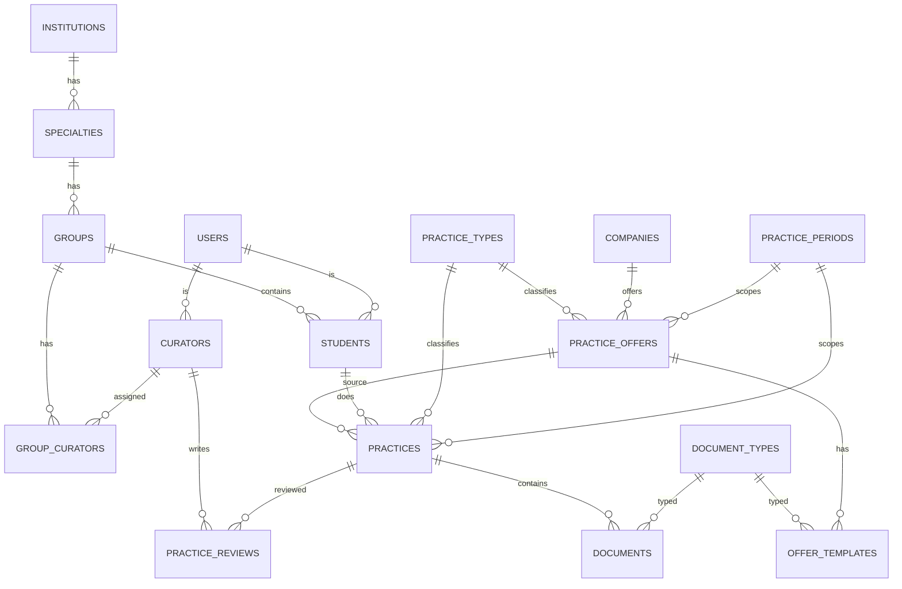

# Техническое задание: Система учёта практик студентов

**Версия:** 1.0
**Дата:** 16.06.2026
**Статус:** MVP (фаза 1) + роль «Предприятие» как фаза 2

---

## 1. Назначение и цели

### 1.1. Назначение
Веб-приложение для организации, учёта и контроля прохождения практик студентами учебного заведения. Система хранит данные о практиках в реляционной БД, ведёт документооборот (договоры, дневники, отчёты и т.д.) и предоставляет каталог мест практики с готовыми шаблонами документов.

### 1.2. Цели
- Дать студенту единое место для выбора места практики, заполнения и загрузки документов.
- Дать куратору инструмент контроля: видеть свои группы, статусы практик, проверять документы и ставить оценки.
- Дать администратору средства управления справочниками, аккаунтами и периодами практик.
- Снизить число ошибок в документах за счёт шаблонов и каталога предложений.

### 1.3. Границы (scope)
- **Фаза 1 (MVP):** роли Студент, Куратор, Администратор; каталог мест практики, наполняемый куратором/админом.
- **Фаза 2:** роль Предприятие (самостоятельное размещение мест и шаблонов). Спроектирована заранее (см. §11), чтобы не переделывать схему.

---

## 2. Технологический стек

### 2.1. Рекомендуемый стек
| Слой | Технология | Обоснование |
|------|-----------|-------------|
| Frontend + Backend | **Next.js 15** (App Router, Server Actions + Route Handlers) | Единый фреймворк, серверный рендеринг, API в `app/api/*`, серверные действия для форм |
| Язык | **TypeScript** | Типобезопасность, удобство генерации кода нейросетью |
| База данных | **PostgreSQL 16** | Реляционные связи, транзакции (важно для счётчика мест), JSONB для гибких полей |
| ORM | **Prisma** | Декларативная схема, миграции, типизация; легко описать нейросети |
| Аутентификация | **Auth.js (NextAuth v5)** | Credentials + сессии/JWT, роли через `session.user.role` |
| Хранилище файлов | **S3-совместимое** (AWS S3 / MinIO для self-host) | В БД хранится только путь/ключ, файлы — в объектном хранилище |
| UI-библиотека | **Ant Design** (или Mantine) | Готовые таблицы, фильтры, формы, загрузка файлов, модалки — идеально под CRUD/дашборды |
| Валидация | **Zod** | Единые схемы валидации на клиенте и сервере |

### 2.2. Альтернативные варианты
- **ORM:** Drizzle ORM (ближе к SQL, легче и быстрее Prisma) — если нужен полный контроль над запросами.
- **UI:** shadcn/ui + Tailwind CSS — более кастомный современный вид, но больше ручной работы; Mantine — золотая середина.
- **Хранилище файлов:** UploadThing (быстрый старт, без настройки S3) или локальная папка + БД-путь (только для прототипа).
- **Аутентификация:** Clerk / Lucia Auth — если Auth.js покажется тяжёлым.
- **БД-хостинг:** Neon / Supabase (Postgres в облаке с готовым пулингом) либо self-host PostgreSQL.

---

## 3. Роли и права доступа

| Возможность | Студент | Куратор | Администратор | Предприятие (Ф2) |
|-------------|:------:|:-------:|:------------:|:----------------:|
| Регистрация/вход | ✔ | ✔ | ✔ | ✔ |
| Просмотр каталога мест практики | ✔ | ✔ | ✔ | свои |
| Выбор места практики | ✔ | — | — | — |
| Загрузка своих документов | ✔ | — | — | — |
| Просмотр своих практик и статусов | ✔ | — | — | — |
| Просмотр студентов своих групп | — | ✔ | ✔ | — |
| Проверка документов, смена статуса, оценка | — | ✔ | ✔ | — |
| Создание/наполнение каталога мест | — | ✔ | ✔ | ✔ (свои) |
| Управление группами и студентами | — | — | ✔ | — |
| Назначение кураторов на группы | — | — | ✔ | — |
| Управление периодами практик и справочниками | — | — | ✔ | — |
| Управление всеми аккаунтами | — | — | ✔ | — |

**Модель доступа:** RBAC (role-based access control). Роль хранится в `users.role`. Дополнительно — проверка владения ресурсом (куратор видит только свои группы; студент — только свои практики).

---

## 4. Функциональные требования (по ролям)

### 4.1. Студент
- FR-S1. Регистрация/вход; редактирование профиля.
- FR-S2. Просмотр каталога предложений практики с фильтрами (тип практики, период, наличие свободных мест).
- FR-S3. Выбор предложения → автоматически создаётся практика в статусе «черновик», документы создаются из шаблонов предложения.
- FR-S4. Ручной ввод места практики (если в каталоге нет нужного) — поле «своё место».
- FR-S5. Заполнение персональных данных в документах и загрузка файлов (договор, дневник, отчёт и т.д.).
- FR-S6. Отправка практики на проверку куратору (статус «на проверке»).
- FR-S7. Просмотр статуса, замечаний куратора и итоговой оценки.

### 4.2. Куратор
- FR-C1. Просмотр своих групп и студентов в них.
- FR-C2. Просмотр практик студентов: место, тип, период, статус, документы.
- FR-C3. Проверка документов: принять / отправить на доработку с комментарием.
- FR-C4. Смена статуса практики и выставление итоговой оценки.
- FR-C5. Создание и наполнение каталога предложений практики (место, число мест, шаблоны документов).
- FR-C6. Выгрузка отчёта/ведомости по группе (CSV/Excel) — желательно.

### 4.3. Администратор
- FR-A1. CRUD учебных заведений, специальностей, групп.
- FR-A2. CRUD аккаунтов (студенты, кураторы), назначение кураторов на группы.
- FR-A3. Управление периодами практик (учебные семестры/кампании).
- FR-A4. Управление справочниками (типы практик, типы документов, предприятия).
- FR-A5. Полный доступ к каталогу и практикам (модерация).

### 4.4. Общие
- FR-G1. Аутентификация и авторизация по ролям.
- FR-G2. Уведомления о смене статуса (на старте — внутри приложения; e-mail — опционально).
- FR-G3. Аудит ключевых действий (смена статуса, оценка) — желательно.

---

## 5. Нефункциональные требования
- NFR-1. Безопасность: пароли — bcrypt/argon2; защита маршрутов middleware'ом по ролям; валидация входных данных (Zod) на сервере.
- NFR-2. Файлы: ограничение типов (pdf, doc, docx, jpg, png) и размера (напр. до 10 МБ); приватный доступ через подписанные URL.
- NFR-3. Целостность: операции со счётчиком свободных мест — в транзакции, чтобы исключить «переподписку».
- NFR-4. Производительность: пагинация и серверная фильтрация в таблицах.
- NFR-5. Локализация: интерфейс на русском; даты/время в часовом поясе заведения.
- NFR-6. Масштабируемость схемы: предусмотрены поля и связи для роли «Предприятие» (фаза 2).

---

## 6. Статусы практики (workflow)

```
draft ──submit──▶ submitted ──review──▶ needs_revision ──resubmit──▶ submitted
                       │
                       └──review──▶ approved ──complete──▶ completed (с оценкой)
                       └──review──▶ rejected
```

| Код | Название | Описание | Кто меняет |
|-----|----------|----------|-----------|
| `draft` | Черновик | Студент заполняет документы | Студент |
| `submitted` | На проверке | Отправлено куратору | Студент → Куратор |
| `needs_revision` | На доработке | Куратор вернул с замечаниями | Куратор |
| `approved` | Принято | Документы приняты | Куратор |
| `rejected` | Отклонено | Практика не принята | Куратор |
| `completed` | Завершено | Выставлена итоговая оценка | Куратор |

**Статусы документа:** `uploaded` (загружен) → `accepted` (принят) / `rejected` (отклонён, с комментарием).

---

## 7. Модель данных (ER-диаграмма)



---

## 8. Схема таблиц (PostgreSQL)

> Соглашения: первичный ключ `id BIGSERIAL` (или UUID), у всех таблиц `created_at TIMESTAMPTZ DEFAULT now()`, `updated_at TIMESTAMPTZ`. Перечисления реализуются через `ENUM`-типы Postgres или таблицы-справочники.

### 8.1. users — пользователи (аккаунты)
| Поле | Тип | Описание |
|------|-----|----------|
| id | BIGSERIAL PK | Идентификатор |
| email | VARCHAR(255) UNIQUE NOT NULL | Логин |
| password_hash | VARCHAR(255) NOT NULL | Хэш пароля |
| full_name | VARCHAR(255) NOT NULL | ФИО |
| role | ENUM('student','curator','admin','company') NOT NULL | Роль |
| phone | VARCHAR(32) | Телефон |
| is_active | BOOLEAN DEFAULT true | Активен ли аккаунт |

### 8.2. institutions — учебные заведения
| Поле | Тип | Описание |
|------|-----|----------|
| id | BIGSERIAL PK | |
| name | VARCHAR(255) NOT NULL | Название |
| short_name | VARCHAR(64) | Аббревиатура |

### 8.3. specialties — специальности
| Поле | Тип | Описание |
|------|-----|----------|
| id | BIGSERIAL PK | |
| institution_id | BIGINT FK → institutions(id) | Заведение |
| code | VARCHAR(32) | Шифр специальности |
| name | VARCHAR(255) NOT NULL | Название |

### 8.4. groups — учебные группы
| Поле | Тип | Описание |
|------|-----|----------|
| id | BIGSERIAL PK | |
| specialty_id | BIGINT FK → specialties(id) | Специальность |
| name | VARCHAR(64) NOT NULL | Номер/название группы |
| course | SMALLINT | Курс |
| enrollment_year | SMALLINT | Год набора |

### 8.5. students — студенты (профиль)
| Поле | Тип | Описание |
|------|-----|----------|
| id | BIGSERIAL PK | |
| user_id | BIGINT FK → users(id) UNIQUE | Аккаунт |
| group_id | BIGINT FK → groups(id) | Группа |
| record_book_no | VARCHAR(32) | Номер зачётки |

### 8.6. curators — кураторы (профиль)
| Поле | Тип | Описание |
|------|-----|----------|
| id | BIGSERIAL PK | |
| user_id | BIGINT FK → users(id) UNIQUE | Аккаунт |
| position | VARCHAR(128) | Должность |
| department | VARCHAR(128) | Кафедра/отделение |

### 8.7. group_curators — назначение кураторов на группы (M:N)
| Поле | Тип | Описание |
|------|-----|----------|
| id | BIGSERIAL PK | |
| group_id | BIGINT FK → groups(id) | Группа |
| curator_id | BIGINT FK → curators(id) | Куратор |
| UNIQUE(group_id, curator_id) | | |

### 8.8. practice_periods — кампании/периоды практик
| Поле | Тип | Описание |
|------|-----|----------|
| id | BIGSERIAL PK | |
| name | VARCHAR(128) NOT NULL | Напр. «Произв. практика, осень 2026» |
| date_start | DATE NOT NULL | Начало |
| date_end | DATE NOT NULL | Конец |
| is_open | BOOLEAN DEFAULT true | Открыт ли набор |

### 8.9. practice_types — типы практик (справочник)
| Поле | Тип | Описание |
|------|-----|----------|
| id | BIGSERIAL PK | |
| code | VARCHAR(32) UNIQUE | напр. educational/industrial/pre_diploma |
| name | VARCHAR(128) NOT NULL | Учебная/Производственная/Преддипломная |

### 8.10. document_types — типы документов (справочник)
| Поле | Тип | Описание |
|------|-----|----------|
| id | BIGSERIAL PK | |
| code | VARCHAR(32) UNIQUE | contract/referral/diary/report/reference/attestation |
| name | VARCHAR(128) NOT NULL | Договор/Направление/Дневник/Отчёт/Характеристика/Аттестационный лист |
| is_required | BOOLEAN DEFAULT true | Обязателен ли |

### 8.11. companies — предприятия (справочник)
| Поле | Тип | Описание |
|------|-----|----------|
| id | BIGSERIAL PK | |
| name | VARCHAR(255) NOT NULL | Название |
| inn | VARCHAR(16) | ИНН/реквизиты |
| address | VARCHAR(255) | Адрес |
| contact_person | VARCHAR(255) | Контактное лицо |
| contact_phone | VARCHAR(32) | Телефон |
| owner_user_id | BIGINT FK → users(id) NULL | Аккаунт предприятия (фаза 2), NULL для заведённых вручную |

### 8.12. practice_offers — предложения практики (каталог)
| Поле | Тип | Описание |
|------|-----|----------|
| id | BIGSERIAL PK | |
| company_id | BIGINT FK → companies(id) | Предприятие/место |
| practice_type_id | BIGINT FK → practice_types(id) | Тип практики |
| period_id | BIGINT FK → practice_periods(id) | Период |
| title | VARCHAR(255) NOT NULL | Заголовок предложения |
| description | TEXT | Описание, требования |
| slots_total | INT NOT NULL | Всего мест |
| slots_taken | INT NOT NULL DEFAULT 0 | Занято мест |
| created_by | BIGINT FK → users(id) | Кто создал (куратор/админ/предприятие) |
| is_published | BOOLEAN DEFAULT true | Виден ли студентам |
| CHECK (slots_taken <= slots_total) | | Защита от переподписки |

### 8.13. offer_templates — шаблоны документов предложения
| Поле | Тип | Описание |
|------|-----|----------|
| id | BIGSERIAL PK | |
| offer_id | BIGINT FK → practice_offers(id) | Предложение |
| document_type_id | BIGINT FK → document_types(id) | Тип документа |
| file_key | VARCHAR(512) | Ключ шаблона в хранилище |
| prefilled_fields | JSONB | Предзаполненные поля (реквизиты предприятия и т.п.) |

### 8.14. practices — практики студентов (ядро)
| Поле | Тип | Описание |
|------|-----|----------|
| id | BIGSERIAL PK | |
| student_id | BIGINT FK → students(id) | Студент |
| practice_type_id | BIGINT FK → practice_types(id) | Тип практики |
| period_id | BIGINT FK → practice_periods(id) | Период |
| offer_id | BIGINT FK → practice_offers(id) NULL | Источник из каталога (NULL = своё место) |
| company_id | BIGINT FK → companies(id) NULL | Предприятие (если из каталога) |
| custom_place | VARCHAR(255) NULL | Своё место практики (если не из каталога) |
| date_start | DATE | Дата начала |
| date_end | DATE | Дата окончания |
| status | ENUM('draft','submitted','needs_revision','approved','rejected','completed') DEFAULT 'draft' | Статус |
| grade | VARCHAR(16) NULL | Итоговая оценка |
| submitted_at | TIMESTAMPTZ NULL | Когда отправлено на проверку |

### 8.15. documents — документы практики
| Поле | Тип | Описание |
|------|-----|----------|
| id | BIGSERIAL PK | |
| practice_id | BIGINT FK → practices(id) | Практика |
| document_type_id | BIGINT FK → document_types(id) | Тип документа |
| file_key | VARCHAR(512) NOT NULL | Ключ файла в хранилище |
| original_name | VARCHAR(255) | Исходное имя файла |
| status | ENUM('uploaded','accepted','rejected') DEFAULT 'uploaded' | Статус проверки |
| review_comment | TEXT NULL | Комментарий куратора |
| uploaded_by | BIGINT FK → users(id) | Кто загрузил |

### 8.16. practice_reviews — история проверок (аудит)
| Поле | Тип | Описание |
|------|-----|----------|
| id | BIGSERIAL PK | |
| practice_id | BIGINT FK → practices(id) | Практика |
| curator_id | BIGINT FK → curators(id) | Куратор |
| old_status | VARCHAR(32) | Прежний статус |
| new_status | VARCHAR(32) | Новый статус |
| comment | TEXT | Комментарий |

---

## 9. API (Route Handlers / Server Actions)

> Базовый префикс `/api`. Все защищённые маршруты требуют сессии; доступ проверяется по роли и владению ресурсом. Ответы — JSON, пагинация через `?page&pageSize`, фильтры — query-параметрами.

### 9.1. Аутентификация
| Метод | Путь | Роль | Назначение |
|-------|------|------|-----------|
| POST | /api/auth/register | гость | Регистрация (роль по умолчанию student) |
| POST | /api/auth/login | гость | Вход |
| POST | /api/auth/logout | авториз. | Выход |
| GET | /api/me | авториз. | Текущий профиль |

### 9.2. Каталог предложений
| Метод | Путь | Роль | Назначение |
|-------|------|------|-----------|
| GET | /api/offers | все | Список предложений (фильтры: тип, период, наличие мест) |
| GET | /api/offers/:id | все | Детали предложения + шаблоны |
| POST | /api/offers | curator, admin, company | Создать предложение |
| PUT | /api/offers/:id | владелец, admin | Изменить |
| DELETE | /api/offers/:id | владелец, admin | Удалить |
| POST | /api/offers/:id/templates | владелец, admin | Загрузить шаблон документа |

### 9.3. Практики
| Метод | Путь | Роль | Назначение |
|-------|------|------|-----------|
| GET | /api/practices | student (свои), curator/admin (по группам) | Список практик |
| GET | /api/practices/:id | владелец/куратор/admin | Детали практики + документы |
| POST | /api/practices | student | Создать практику (из offer или своё место); транзакция увеличивает slots_taken |
| PUT | /api/practices/:id | student (в draft/needs_revision) | Редактировать |
| POST | /api/practices/:id/submit | student | Отправить на проверку |
| POST | /api/practices/:id/review | curator, admin | Сменить статус (approved/needs_revision/rejected) + комментарий |
| POST | /api/practices/:id/grade | curator, admin | Завершить и выставить оценку |

### 9.4. Документы
| Метод | Путь | Роль | Назначение |
|-------|------|------|-----------|
| POST | /api/practices/:id/documents | student | Загрузить документ (получение presigned URL) |
| PUT | /api/documents/:id | student (если не accepted) | Заменить файл |
| POST | /api/documents/:id/review | curator, admin | Принять/отклонить документ + комментарий |
| GET | /api/documents/:id/download | владелец/куратор/admin | Подписанная ссылка на скачивание |

### 9.5. Администрирование (роль admin)
| Метод | Путь | Назначение |
|-------|------|-----------|
| GET/POST/PUT/DELETE | /api/admin/institutions | Учебные заведения |
| GET/POST/PUT/DELETE | /api/admin/specialties | Специальности |
| GET/POST/PUT/DELETE | /api/admin/groups | Группы |
| GET/POST/PUT/DELETE | /api/admin/users | Аккаунты |
| POST | /api/admin/groups/:id/curators | Назначить куратора на группу |
| GET/POST/PUT/DELETE | /api/admin/periods | Периоды практик |
| GET/POST/PUT/DELETE | /api/admin/dictionaries/* | Справочники (типы практик, типы документов, предприятия) |

---

## 10. Ключевые сценарии (use cases)

### 10.1. Студент выбирает место из каталога
1. Студент открывает каталог `/api/offers` (фильтр: его период, есть свободные места).
2. Выбирает предложение → POST `/api/practices` с `offer_id`.
3. В транзакции: проверка `slots_taken < slots_total` → создание практики (`draft`) → `slots_taken += 1` → копирование шаблонов из `offer_templates` в `documents` студента.
4. Студент дозаполняет поля, при необходимости загружает свои файлы, жмёт «Отправить» → `submit`.

### 10.2. Студент указывает своё место
1. POST `/api/practices` с `custom_place` без `offer_id`.
2. Создаётся практика `draft`; студент сам загружает все обязательные документы.

### 10.3. Куратор проверяет практику
1. Куратор открывает список практик своих групп (статус `submitted`).
2. Просматривает документы, по каждому: `accept`/`reject` с комментарием.
3. По практике: `approved` / `needs_revision` / `rejected`; запись в `practice_reviews`.
4. По завершении — `grade` (статус → `completed`).

---

## 11. Фаза 2 — роль «Предприятие» (заложено в схему)
- Аккаунт предприятия: `users.role='company'`, связь `companies.owner_user_id`.
- Предприятие самостоятельно создаёт `practice_offers`, задаёт `slots_total` и загружает `offer_templates`.
- Предприятие видит только свои предложения и (опционально) обезличенный список откликнувшихся студентов.
- Требует дополнительной модерации (админ подтверждает аккаунт предприятия) и политики приватности персональных данных студентов.

В фазе 1 эти поля присутствуют, но не используются (каталог наполняют куратор/админ), поэтому переход к фазе 2 не требует изменения схемы БД.

---

## 12. Открытые вопросы / на уточнение
- Нужна ли e-mail/SMS-нотификация в MVP или достаточно уведомлений внутри приложения?
- Нужна ли электронная подпись документов или достаточно загрузки сканов?
- Один студент за период — одна практика, или возможно несколько одновременно?
- Нужны ли роли «зав. отделением»/«методист» помимо куратора и админа?
- Формат и состав итоговой отчётности (ведомости) для куратора.

---

## 13. Примечания для генерации кода нейросетью
- Стек фиксирован: **Next.js 15 (App Router) + TypeScript + PostgreSQL + Prisma**. ORM-схему сгенерировать по §8, миграции — `prisma migrate`.
- Все ENUM из §6 и §8 объявить как Postgres enum или Prisma enum.
- Реализовать middleware авторизации по матрице из §3.
- Операции со `slots_taken` (§10.1, шаг 3) — обязательно в транзакции с проверкой `CHECK`.
- Файлы — через presigned URL, в БД хранить только `file_key`.
- UI: таблицы со серверной пагинацией и фильтрами (Ant Design Table/Form/Upload).
